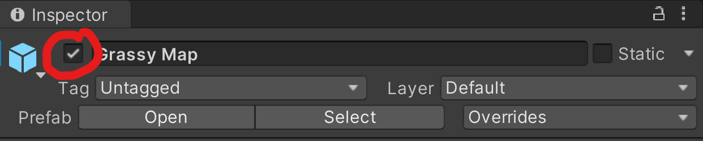
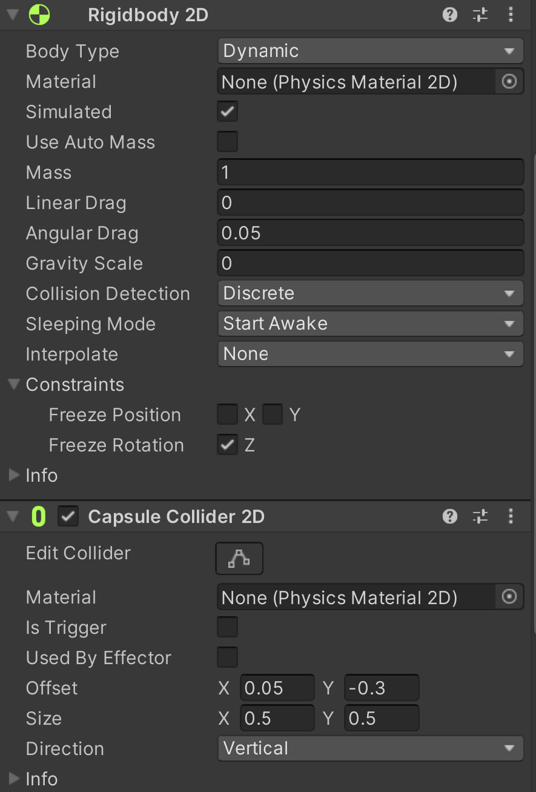

## Section 1 - Creating the Player


___
## In this section, we will be creating the player and their basic actions. This will include a couple things:

### 1. move in four directions
### 2. attack in four directions


## Player Movement

#### Summary:
1. Create the player object, and add the player movement script
2. Be able to move the player object in any direction.


Before creating the player, disable all other components in the scene, specifically *Grassy Map*, *AudioManager*, and *CM vcam1*. Look into the inspector tab, and click the checkmark in the top left corner to remove it from view.




Create a 2D sprite by right clicking in the hierarchy and going to `2D Object -> Sprite` and reset it's position by looking in the `Transform` component and changing the positions to 0. Then change the name of sprite from New Sprite to "Player". 

{: .warning}
> Keep in mind that Unity is strict on naming conventions, and this guide will assume you name it exactly as the given. "Player" is not the same as "player".
>


In the *Sprite Renderer* component, change the Sprite from None to `idle_east_1`.

Add a new component titled *Rigidbody 2D* and a *Capsule Collider 2D*. Make sure that the `Body Type` for the Rigidbody component is `Dynamic` and `Gravity Scale` is `0`. Check the `Freeze Rotation` box as well.

In the `Capsule Collider`, we want to set the hitbox of the sprite to be the same size as the sprite. In order to add some depth, we will set the hitbox as the feet of the sprite. You may use the numbers in the image below, and to check if your `Rigidbody` is also correct.


Now go into the `Scripts` folder, and create a new script by right clicking inside the folder, and `Create -> C# Script`. Name it *PlayerController*, and then open the file. Delete the two starter functions (the Start and Update functions) so then we can start from scratch.

In order to keep our code clean, we will use `#region` boundaries to sort and organize our variables. You can see it in the given code here.

```
#region Movement_variables
public float movespeed;
float x_input;
float y_input;
#endregion

#region Physics_components
Rigidbody2D PlayerRB;
#endregion

#region Unity_functions
private void Awake()
{

}

private void Update()
{

}
#endregion

```

- `movespeed` will control how fast the player can move. Note that it is public, such that we can edit it in the inspector in real time to try different speeds. 
- `x_input` and `y_input` will be used to determine where the player should be going based on the user input. 
- `PlayerRb` will control the forces we add onto the player.
- `Awake()` is called ONCE when the object is created, and never again.
- `Update()` is called EVERY frame. This means that **we do not want any intensive or heavy code in Update** as that would be costly, and could lag, or even crash your game. 

Here, we will leave you with a small coding exercise. If you can't do it off the top of your head, no worries! You can follow the project video linked with the timestamp.

{: .important}
> You will need to translate the hex code below to ASCII in order to get the link with the correct timestamp. This will be the case for all youtube links.

```
68 74 74 70 73 3A 2F 2F 79 6F 75 74 75 2E 62 65 2F 64 73 4D 6B 44 6E 75 43 64 2D 41 3F 6C 69 73 74 3D 50 4C 6B 54 71 66 35 44 42 7A 50 73 41 65 2D 70 52 35 62 44 55 64 77 48 69 43 4E 67 48 63 79 42 49 68 26 74 3D 33 36 35
```

- In `Awake()`, set a variable `PlayerRB` to the `Rigidbody2D` component using the `GetComponent` function.
- In `Update()`, you will need to do two things.
  1. Access the user input values (button presses that correspond to the movement in the game) and map them in Update().
     -  This will require you access the Input Manager which is located in `Edit -> Project Settings -> Input Manager` to determine which buttons the project assumes as the positive and negative button for horizontal and vertical movement. For our case, we will use WASD.
     -  Use the function `Input.GetAxisRaw()` to get the raw input for the horizontal and vertical movement (which should be a value from -1 to 1), and set them to `x_input` and `y_input` respectfully. 
  2. Create the function `private void Move(){}` function inside the `Movement_functions` region which will move the player based on the `x_input` and `y_input`.
     -  You will need 5 cases to determine what the player should do.
     -  Set `PlayerRB.velocity` to `Vector.up/down/left/right` based on which case you are on.
  
To check if we have coded this correctly, drag the *PlayerController* script into the component section of our Player, and put in some value for Movespeed.

{: .note}
> If you are having trouble viewing your player, you might have to adjust the z axis of the Main Camera object. First, uncheck the *CinemachineBrain* component, and set the Z position to be -3.

Now, click the play button once, and, after it loads, see if your player is visible, and moves using the WASD keys. 

{: .highlight}
You may notice that some keys override the keys of others (when pushing both down and left, your character may only go left) - this is because the tutorial's implementation of code is not the best way of implementing player movement. Feel free to improve / change this function from the tutorial code as you see fit.

## Player Attacks

#### Summary:
1. Be able to attack when pressing the "J" key in all four directions
2. Cast the hitbox in the right direction
3. Add animations

Copy and paste this code block into your *PlayerController* script, which will define some new variables for you.

```
#region Attack_variables
public float Damage;
float attackSpeed = 1;
float attackTimer;
public float hitBoxTiming;
public float endAnimationTiming;
bool isAttacking;
Vector2 currDirection;
#endregion

#region Attack_functions
private void Attack()
{
    Debug.Log("attacking now");
}

IEnumerator AttackRoutine()
{
    yield return null;
}

#endregion
```


- `Damage` is how much damage you do each hit.
- `attackSpeed` is how long you need to wait before you have to attack again. 
- `attackTimer` will work with `attackSpeed` by timing when the player last hit. On attacking, it will reset, and count down once more.
- `hitBoxTiming` and `endAnimationTiming` will allow us to have a delay from when the animation starts, to when we actually hit the enemy. This will make the animation feel more convincing by having it hit when the sword is being swung, rather than when it is winding up.
- `isAttacking` will let us know if the user has inputted an attack, which will then pause our movement.
- `currDirection` will make sure that if we attack right, we attack right, rather than to a different direction.
- `Attack()` is the function that will be called when the player attacks.
- `AttackRoutine()` will handle animations and hitboxes for the attack mechanisms. 

{: .note}
> You may notice that the data type of the `AttackRoutine()` function is an IEnumerator rather than a public or private function. This is an example of a **coroutine** which you will learn about in a later lab. If you have taken 61A, it is similar to yield functions and generators.

In `Update()`, using the key "J" as your attack key, call the private `Attack()` function when the "J" key is pressed down. You will need to use `Input.GetKeyDown(KeyCode.J)` to determine if the key is being pressed. If you need help, the link to the video tutorial is below.

```
68 74 74 70 73 3A 2F 2F 79 6F 75 74 75 2E 62 65 2F 64 73 4D 6B 44 6E 75 43 64 2D 41 3F 6C 69 73 74 3D 50 4C 6B 54 71 66 35 44 42 7A 50 73 41 65 2D 70 52 35 62 44 55 64 77 48 69 43 4E 67 48 63 79 42 49 68 26 74 3D 31 31 34 39
```


If you save, and press play, you should see in the bottom left a print statement saying `attacking now`. This is your console, and will be very helpful in debugging, and testing code in labs, and projects. It will also display any warnings, and errors that you may have.

We will now make it such that you cannot spam the ability as fast as you can using the `attackSpeed` and `attackTimer` variables.

Initialize the `attackTimer` variable in `Awake()` to 0, as that will indicate that we can attack again. 

Then, in Update, add a conditional statement to check if `attackTimer < 0`. If not, we don't want to attack, and subtract `Time.deltaTime`, but if we do attack, we want to call the `Attack()` function, which will now also add `attackTimer = attackSpeed;` to set the cooldown. If you need help, the timestamp is below.

```
68 74 74 70 73 3A 2F 2F 79 6F 75 74 75 2E 62 65 2F 64 73 4D 6B 44 6E 75 43 64 2D 41 3F 6C 69 73 74 3D 50 4C 6B 54 71 66 35 44 42 7A 50 73 41 65 2D 70 52 35 62 44 55 64 77 48 69 43 4E 67 48 63 79 42 49 68 26 74 3D 31 33 34 30
```

Now, if you go to the Player object, there will be an input field for AttackSpeed, so set it to 3, save, and play the game to see if the cooldown is working. 

We now want it to only attack in the direction we are facing, which will use the `currDirection` variable, and set it whenever we call the `Move()` function. For instance, if we are moving to the left, we would set `currDirection = Vector2.left;`

You can now check to make sure that it works by adding another Debug statement in `Attack()` to check the current direction with `Debug.Log(currDirection);` which will print out two values to display the current direction. 

Finally, in the inspector, change the AttackSpeed to 0.5, since we don't only want to be able to attack every 3 seconds.

Now, we will start on being able to cast the hitbox in the right direction, which will mainly be done in the coroutine, or the `IEnumerator` function titled `AttackRoutine()`.

`AttackRoutine()` needs to be called using the function `StartCoroutine()`, which will be run at the very end of our `Attack()` function. 

Then, you may copy this code into the `AttackRoutine()` function:

```
IEnumerator AttackRoutine()
{
    isAttacking = true;
    PlayerRB.velocity = Vector2.zero;
    yield return new WaitForSeconds(hitBoxTiming);
    Debug.Log("Casting hitbox now");
    RaycastHit2D[] hits = Physics2D.BoxCastAll(PlayerRB.position + currDirection, Vector2.one, 0f, Vector2.zero);

    foreach(RaycastHit2D hit in hits)
    {
        if(hit.transform.CompareTag("Enemy"))
        {
            Debug.Log("Tons of damage");
        }
    }

    yield return new WaitForSeconds(hitBoxTiming);
    isAttacking = false;

}
```
  - We set `isAttacking` to true, and set the player's velocity to 0, as, a design choice, the player will not be able to move when they attack.
  - `yield return new WaitForSeconds(hitBoxTiming);` will basically pause the running of the function for `hitBoxTiming` number of seconds before running the next line.
  - `hits` is an array of all the objects that are colliding with a box that is in front of the player. To learn more about `BoxCastAll`, you can check out the function description [here](https://docs.unity3d.com/ScriptReference/Physics2D.BoxCastAll.html). **We highly suggest you read through the documentation and understand what each input is.** The video also describes each variable at the timestamp given below.
  - We will then iterate through each hit that we found from our raycast, and if it has the tag of "Enemy", will print the statement "Tons of damage".
  - We will then wait `hitBoxTiming` seconds, and then set `isAttacking` back to false.
  
```
68 74 74 70 73 3A 2F 2F 79 6F 75 74 75 2E 62 65 2F 64 73 4D 6B 44 6E 75 43 64 2D 41 3F 6C 69 73 74 3D 50 4C 6B 54 71 66 35 44 42 7A 50 73 41 65 2D 70 52 35 62 44 55 64 77 48 69 43 4E 67 48 63 79 42 49 68 26 74 3D 31 37 37 39
```

{: .note}
> Tags are labels we can assign to every game object, and is useful in selecting specific types of objects.


Go back into Unity, and set the Player object to have the Player tag. This will be right under the Object name. 

Now, add an `if` statement at the very beginning of `Update()` to check if `isAttacking` is true. If so, then just return. 

Save your script, and go back into the inspector for the Player object. Set `Damage` to 2, `hitBoxTiming` and `endAnimationTiming` as 0.1, and `Movespeed` remaining the same at 2.

If you press play, you will now see that if you attack, the player will pause for a brief moment before resuming movement.

Now, add the animation controller 👍
 
<!-- 


What fun is a game if there are no enemies to fight?

In this section, we will be creating a enemy for the player to fight. The enemy will have a line of sight and if the player is within the enemy's line of sight, it will move towards the player and explode upon contact; dealing damage to the player. In return, the player will also be able to deal damage back to the enemy. 

### Enemy setup
Like you did with the player, make a new game object and name it *Enemy*, attach a Circle Collider 2D and a Rigidbody 2D. 
Modify the Rigidbody 2D by setting gravity to zero and freezing z rotation (fig 1).

[insert fig1]

Next, set the Enemy game object's tag to Enemy.
Now, we have a basic enemy game object. 

An enemy should attack the player if the player is within a certain radius. 

To create a detection system, lets make a new game object that is a **child of the Enemy game object**; name this game object *LineOfSight*. 

Attach a Circle Collider 2D to your newly created *LineOfSight* game object and **check the IsTrigger checkbox**. When the player enters this circle collider, it will notify the enemy to move and attack the player; adjust the radius of the LineOfSight collider to fit your desired range.

[insert img of LineOfSight Inspector]

### Programming the enemy logic

Now, we need to implement the logic to make the enemy move towards and attack the player. 
Make a new script in the scripts folder and name it *Enemy*. Inside the *Enemy* script, set up 3 regions:

1. Movement_variables
2. Unity_functions
3. Movement_functions


### Enemy movement system

Lets move the enemy towards the player. First, we need three variables:

A float variable named *moveSpeed*. This variable will let us control the movement speed of the enemy. Make it pubilc so that we can adjust the enemy's speed in the unity inspector. 

To actually move the player, **create a RigidBody 2D variable** to hold a reference to the enemy's rigidbody.

The enemy will be moving towards the enemy, so it needs to know the location of the player game object. Create a Transform variable named player. Make this public or protected (protected means scripts of children game objects have access).

In awake(), set the rb variable to the RigidBody 2D component attached to the enemy game object.

[img of findComponent fig4]

Using the three variables we just created, implement the logic for the enemy's movement system: **if the player triggers the LineOfSight collider, move the enemy towards the player's transform position.** You will need to edit the Move() and Update() functions in the *Enemy* script, in addition to the OnTriggerEnter2D script in the *LineOfSight* script. 

**Task: implement move() and finish the logic in update() of the Enemy script. Fill in the logic for OnTriggerEnter2D() in the LineOfSight script**

Solution (translate hex to ASCII): 

```
68 74 74 70 73 3A 2F 2F 79 6F 75 74 75 2E 62 65 2F 49 39 4A 47 39 6B 55 31 37 52 49 3F 73 69 3D 4B 4A 52 68 50 6E 78 72 36 54 45 48 51 71 59 69 26 74 3D 35 39 31
```

### Dealing damage to the player 

Now, when the player gets too close to the enemy, the ghost should chase the player. Currently, if you stop moving, the ghost will just push you off the screen. Instead, we want the ghost to explode and deal damage upon contact with the player.

In the *Enemy* script, create a new *Attack_variables* region and add three variables to it: *explosionDamage*, *explosionRadius*, and *explosionObj*. The first two are of type float and *explosionObj* is of type GameObject. All three should be public, so we can adjust and reference as needed in the unity inspector. 

[img of attack variables fig5]

Inside the same *Enemy* script, there is a Explode() function you need to implement. The function will be invoked when the player and ghost make contact. Upon contact, a explosion animation will spawn in place of the enemy and deal *explosionDamage* to any player within the *explosionRadius*. Then, destroy the enemy game object at the very end.

**Task: implement Explode()**

Hint: Use a 2D circle raycast (https://docs.unity3d.com/ScriptReference/Physics2D.CircleCast.html) to detect if the player is within the *explosionRadius*.
The raycast returns an array of all objects caught in the circle cast. They will be of type *RaycastHit2D* which hold the same basic properties as game objects such as the *transform* and *tag* property.
Also make sure to set your attack variables in the unity inspector before testing your code! We provide a explosion prefab located in *Assets > Prefabs* that you can drag into *ExplosionObj*.

Solution (translate hex below to ASCII):

```
68 74 74 70 73 3A 2F 2F 79 6F 75 74 75 2E 62 65 2F 49 39 4A 47 39 6B 55 31 37 52 49 3F 73 69 3D 30 37 55 51 48 35 7A 41 52 65 6A 6E 69 6B 30 58 26 74 3D 31 32 30 37
```

You've implemented the Explode() function, but nothing actually happens yet. That's because it hasn't been called yet. Call this function to make the enemy explode upon contact with the player. 

**Task: In *Enemy.cs*, Invoke your Explode() function in OnCollisionEnter2D() if the enemy collides with the player.**

Solution (translate hex below to ASCII): 

```
68 74 74 70 73 3A 2F 2F 79 6F 75 74 75 2E 62 65 2F 49 39 4A 47 39 6B 55 31 37 52 49 3F 73 69 3D 63 77 74 5A 78 74 78 76 30 37 4C 68 52 51 39 50 26 74 3D 31 35 31 32
```

### Enemy animation (optional)

Enemies look boring as a static sprite. Lets give it some character by animating it's walk cycle. In this case, the ghost enemy doesn't have legs so its going to float around instead. 

We already provide you with a ready-to-go animation located in *Assets > Animations > Enemy*, so you can just drag and drop that in. However, if you would like to get some experience working with the animator and blendtrees (which you'll do a lot) follow the video below to make your animation.

https://youtu.be/I9JG9kU17RI?si=lWHJnjz5SdM0bKCG&t=1613

 -->
