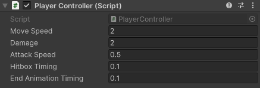
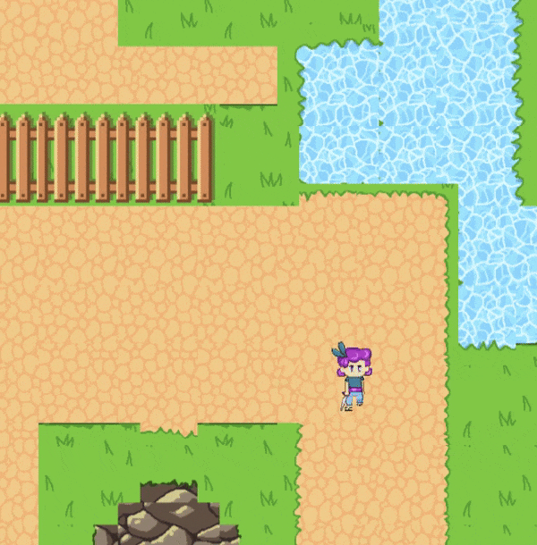

## Section 1 - Creating the Player


___

In this section, we will be kicking off our game development journey by creating the player and implementing their basic actions. By the end of this section your player will be able to:

1. Move in four directions
2. Attack in four directions

{: .important}
> Links to the "solution" on YouTube are spread throughout the entire write up. You will need to translate the hex code below to ASCII in order to get the link with the correct timestamp. This will be the case for all YouTube links.

{: .note}
> An important part of debugging in Unity is using `Debug.Log()`, or print statements to figure out the output of your code, if objects are properly assigned to variables, and generally to gain some sort of insight on what your code is doing. Use these to your advantage if you get stuck debugging, such as figuring out where NullReferenceExceptions are coming from!
## Player Movement

#### Summary:
1. Create the player object, and add the player movement script
2. Be able to move the player object in any direction.

Open up the *SampleScene* scene located in `assets/scenes`. You should see a grassy 2D map in your scene view. 
Look in the hierarchy and select the *Player* object. In the *Sprite Renderer* component, change the Sprite from None to `idle_east_1`.

Add a new component titled *Rigidbody 2D* and a *Capsule Collider 2D*. Make sure that the `Body Type` for the Rigidbody component is `Dynamic` and `Gravity Scale` is `0`. Under **constraints**, Check the `Freeze Rotation` box as well.

In the `Capsule Collider`, we want to set the hitbox of the sprite to be the same size as the sprite. In order to add some depth, we will set the hitbox as the feet of the sprite. You may use the numbers in the image below, and to check if your `Rigidbody` is also correct.


You should see the *Player.cs* script already attached to the Player. Double click it, and open up the script.

{: .note}
> There are two ways to open the script. You can either double click on it via the project directory or through the inspector by clicking on the three dots > edit script. 

In order to keep our code clean, we will use `#region` boundaries to sort and organize our variables. You can see it in the given code here.

```
#region Movement_variables
public float movespeed;
float x_input;
float y_input;
#endregion

#region Physics_components
Rigidbody2D PlayerRB;
#endregion

#region Unity_functions
private void Awake()
{

}

private void Update()
{

}
#endregion

```

- `movespeed` will control how fast the player can move. Note that it is public, such that we can edit it in the inspector in real time to try different speeds. 
- `x_input` and `y_input` will be used to determine where the player should be going based on the user input. 
- `PlayerRb` will control the forces we add onto the player.
- `Awake()` is called ONCE when the object is created, and never again.
- `Update()` is called EVERY frame. This means that **we do not want any intensive or heavy code in Update** as that would be costly, and could lag, or even crash your game. 

Here, we will leave you with a small coding exercise. If you can't do it off the top of your head, no worries! You can follow the project video linked with the timestamp.

**Task 1.1:**

- In `Update()`, you will need to do two things.
  1. Access the user input values (button presses that correspond to the movement in the game) and map them in Update().
     -  This will require you access the Input Manager which is located in `Edit -> Project Settings -> Input Manager->Axes` to determine which buttons the project assumes as the positive and negative button for horizontal and vertical movement. For our case, we will use WASD.
     -  Use the function `Input.GetAxisRaw()` to get the raw input for the horizontal and vertical movement (which should be a value from -1 to 1), and set them to `x_input` and `y_input` respectively. **HINT: `Input.GetAxisRaw()` takes in a singular string as its argument. Link to documentation: https://docs.unity3d.com/ScriptReference/Input.GetAxisRaw.html**
  2. Call the Move() function after you've stored the user input values.
- Now, Implement the Move() function inside the `Movement_functions` region which will move the player based on the `x_input` and `y_input`.
  -  You will need 5 cases to determine what the player should do.
  -  Set `PlayerRB.velocity` to `Vector2.up/down/left/right/zero` based on which case you are on.
 
Functions to modify: 

*PlayerController.cs* -> `Update()` and `Move()`

Solution (translate hex to ASCII):

```
68 74 74 70 73 3A 2F 2F 79 6F 75 74 75 2E 62 65 2F 64 73 4D 6B 44 6E 75 43 64 2D 41 3F 6C 69 73 74 3D 50 4C 6B 54 71 66 35 44 42 7A 50 73 41 65 2D 70 52 35 62 44 55 64 77 48 69 43 4E 67 48 63 79 42 49 68 26 74 3D 33 36 35
```

To check if we have coded this correctly, put in some value for `moveSpeed` (staff solution uses a value of 2f) and see if the player moves with the WASD keys.

{: .note}
> If you are having trouble viewing your player, you might have to adjust the z axis of the Main Camera object. First, uncheck the *CinemachineBrain* component, and set the Z position to be -3.

{: .highlight}
> You may notice that some keys override the keys of others (when pushing both down and left, your character may only go left) - this is because the tutorial's implementation of code is not the best way of implementing player movement. Feel free to improve / change this function from the tutorial code as you see fit.

## Player Attacks

#### Summary:

1. Be able to attack when pressing the "J" key in all four directions
2. Cast the hitbox in the right direction
3. Add animations

Find these regions in your *PlayerController* script, which will define some new variables for you.

```
#region Attack_variables
public float Damage;
float attackSpeed = 1;
float attackTimer;
public float hitBoxTiming;
public float endAnimationTiming;
bool isAttacking;
Vector2 currDirection;
#endregion

#region Attack_functions
private void Attack()
{
    Debug.Log("attacking now");
}

IEnumerator AttackRoutine()
{
    yield return null;
}

#endregion
```
- `Damage` is how much damage you do each hit.
- `attackSpeed` is how long you need to wait before you have to attack again. 
- `attackTimer` will work with `attackSpeed` by timing when the player last hit. On attacking, it will reset, and count down once more.
- `hitBoxTiming` and `endAnimationTiming` will allow us to have a delay from when the animation starts, to when we actually hit the enemy. This will make the animation feel more convincing by having it hit when the sword is being swung, rather than when it is winding up.
- `isAttacking` will let us know if the user has inputted an attack, which will then pause our movement.
- `currDirection` will make sure that if we attack right, we attack right, rather than to a different direction.
- `Attack()` is the function that will be called when the player attacks.
- `AttackRoutine()` will handle animations and hitboxes for the attack mechanisms. 

{: .note}
> You may notice that the data type of the `AttackRoutine()` function is an IEnumerator rather than a public or private function. This is an example of a **coroutine** which you will learn about in a later lab. If you have taken 61A, it is similar to yield functions and generators.

**Task 1.2: Choose an Attack key, and in `Update()`, call the private `Attack()` function when your chosen attack key is pressed down. You will need to use `Input.GetKeyDown(KeyCode key)` function to determine if your chosen key is being pressed. The staff solution uses the J key as the attack key**

Functions to modify:

*PlayerController.cs* -> `Update()`

Solution (translate hex to ascii):

```
68 74 74 70 73 3A 2F 2F 79 6F 75 74 75 2E 62 65 2F 64 73 4D 6B 44 6E 75 43 64 2D 41 3F 6C 69 73 74 3D 50 4C 6B 54 71 66 35 44 42 7A 50 73 41 65 2D 70 52 35 62 44 55 64 77 48 69 43 4E 67 48 63 79 42 49 68 26 74 3D 31 31 34 39
```

If you save, press play, and press your attack key, you should see in the bottom left a print statement saying `attacking now`. This is your console, and will be very helpful in debugging, and testing code in labs, and projects. It will also display any warnings, and errors that you may have.

{: .note}
> For now we just want to check if the attack key is working; you will implement the attacking logic in a later section.

We will now make it such that you cannot spam the ability as fast as you can using the `attackSpeed` and `attackTimer` variables. 

{: .hint}
> Re-read the definitions for `attackSpeed` and `attackTimer` above to understand how you can utilize these two variables to implement an attack cooldown.

Initialize the `attackTimer` variable in `Awake()` to 0, as that will indicate that we can attack again. 

**Task 1.3: In Update(), modify your attacking conditional statement to only call `Attack()` when attackTimer < 0. If not, we don't want to attack, and subtract `Time.deltaTime`, but if we do attack, we want to call the `Attack()` function AND set attackTimer to attackSpeed` to reset the cooldown.**

Functions to modify: 

*PlayerController.cs* -> `Update()`
*PlayerController.cs* -> `Attack()`

{: .note}
> You can complete this task by only modifying `Update()` but the code will be more clean if you seperate your logic between the two functions `Update()` and `Attack()`

Solution (translate hex to ascii):

```
68 74 74 70 73 3A 2F 2F 79 6F 75 74 75 2E 62 65 2F 64 73 4D 6B 44 6E 75 43 64 2D 41 3F 6C 69 73 74 3D 50 4C 6B 54 71 66 35 44 42 7A 50 73 41 65 2D 70 52 35 62 44 55 64 77 48 69 43 4E 67 48 63 79 42 49 68 26 74 3D 31 33 34 30
```

Back in the Unity editor, if you select the Player object, there will be an input field for AttackSpeed, set it to 3, save, and play the game to see if the cooldown is working. 

Notice when we walk in different directions, the player sprite doesn't switch the way it is facing, and it can only attack in one direction.

**Task 1.4: Inside of the `Move()` function, set `currDirection` to the new direction you're moving towards. For instance, if we are moving to the left, we would set `currDirection = Vector2.left;` `currDirection` will be used to orient the player sprite when performing basic actions.**

{: .note}
> You only need to worry about setting currDirection, the function `AttackRoutine()` and the starter code for `Move()` will use `currDirection` to set the correct Player sprite when walking and attacking, that is already taken care of for you. If you would like to set the details of the implementation look inside `AttackRoutine()` and `Move()` or look through the video which implements it from scratch. *Note: the attack animation won’t work until we correctly implement `AttackRoutine()`”


Functions to modify: 

*PlayerController.cs* -> `Move()`

Solution (translate hex to ascii):

```
68 74 74 70 73 3A 2F 2F 77 77 77 2E 79 6F 75 74 75 62 65 2E 63 6F 6D 2F 77 61 74 63 68 3F 76 3D 64 73 4D 6B 44 6E 75 43 64 2D 41 26 6C 69 73 74 3D 50 4C 6B 54 71 66 35 44 42 7A 50 73 41 65 2D 70 52 35 62 44 55 64 77 48 69 43 4E 67 48 63 79 42 49 68 26 74 3D 31 33 34 30 73
```

You can now check to make sure that it works by adding another Debug statement in `Attack()` to check the current direction with `Debug.Log(currDirection);` which will print out two values to display the current direction. 

Finally, in the inspector, change the AttackSpeed to 0.5, since we don't only want to be able to attack every 3 seconds.

Now, we will start on being able to cast the hitbox in the right direction, which is already done for you in the coroutine, or the `IEnumerator` function titled `AttackRoutine()`. *You only need to modify the `Attack()` function by calling `AttackRoutine()` using the function `StartCoroutine()`.*

{: .hint}
> `StartCoroutine()` takes in a coroutine/IEnumerator as its only argument. https://docs.unity3d.com/ScriptReference/MonoBehaviour.StartCoroutine.html

Here is a breakdown of the `AttackRoutine()` function:

```
IEnumerator AttackRoutine()
{
    isAttacking = true;
    PlayerRB.velocity = Vector2.zero;
    yield return new WaitForSeconds(hitBoxTiming);
    Debug.Log("Casting hitbox now");
    RaycastHit2D[] hits = Physics2D.BoxCastAll(PlayerRB.position + currDirection, Vector2.one, 0f, Vector2.zero);

    foreach(RaycastHit2D hit in hits)
    {
        if(hit.transform.CompareTag("Enemy"))
        {
            Debug.Log("Tons of damage");
        }
    }

    yield return new WaitForSeconds(hitBoxTiming);
    isAttacking = false;
}
```
  - We set `isAttacking` to true, and set the player's velocity to 0, as, a design choice, the player will not be able to move when they attack.
  - `yield return new WaitForSeconds(hitBoxTiming);` will basically pause the running of the function for `hitBoxTiming` number of seconds before running the next line.
  - `hits` is an array of all the objects that are colliding with a box that is in front of the player. To learn more about `BoxCastAll`, you can check out the function description [here](https://docs.unity3d.com/ScriptReference/Physics2D.BoxCastAll.html). **We highly suggest you read through the documentation and understand what each input is.** The video also describes each variable at the timestamp given below.
  - We will then iterate through each hit that we found from our raycast, and if it has the tag of "Enemy", will print the statement "Tons of damage".
  - We will then wait `hitBoxTiming` seconds, and then set `isAttacking` back to false.

A video breakdown of this function is avaliable here:

```
68 74 74 70 73 3A 2F 2F 79 6F 75 74 75 2E 62 65 2F 64 73 4D 6B 44 6E 75 43 64 2D 41 3F 6C 69 73 74 3D 50 4C 6B 54 71 66 35 44 42 7A 50 73 41 65 2D 70 52 35 62 44 55 64 77 48 69 43 4E 67 48 63 79 42 49 68 26 74 3D 31 37 37 39
```

Go back into Unity, and set the Player object to have the Player tag. This will be right under the Object name. 

{: .note}
> Tags are labels we can assign to every game object, and is useful in selecting specific types of objects.

Now, add an `if` statement at the very beginning of `Update()` to check if `isAttacking` is true. If so, then just return. 

Save your script, and go back into the inspector for the Player object. Set the following variables to these values:



- `Movespeed` to 2
- `Damage` to 2
- `AttackSpeed` to 0.5
- `hitBoxTiming` and `endAnimationTiming` to 0.1

Except for `hitBoxTiming` and `endAnimationTiming`, feel free to adjust the other variables to whatever values you desire; these are just values for the staff solution.

{: .note}
> Make sure you are constantly saving your project using either `Ctrl+S` or `File > Save` whenever you make changes to it. Unity can crash at any time, so saving frequently can reduce the damage done to your progress when these unlikely scenarios may occur.

If you press Play, you will now see that if you attack, the player will pause for a brief moment before resuming movement.



Congrationlations on finishing this long and tedious section! Feel free to take a tea break before moving onto the next section (:

{: .note}
> You should also see the `anim` variable sprinkled around in the code. This will take care of the animation side of the player, which we have already provided for you.
