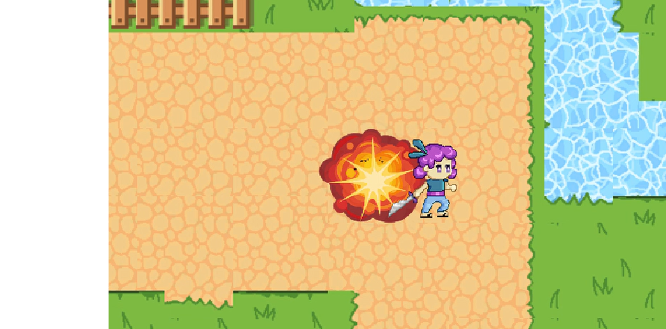

## Section 2 - Creating the Enemies

In the arena of challenges, foes emerge as catalysts for resilience and architects of growth. Embrace the dance with adversaries, for it is through the crucible of opposition that the strength of character is forged.

In this section, we will be creating a enemy for the player to fight. The enemy will have a circular line of sight. If the player enters this line of sight, the enemy will move towards the player and explode upon contact; dealing damage to the player. The player will also be able to deal damage back to the enemy

#### Summary:

1. Create an enemy that tracks and chases the player
2. When the enemy makes contact with the player, it explodes and deals damage to the player
3. Implement the ghost walking animation for the enemy

## Enemy Setup

First, create a empty GameObject by right clicking in the hierarchy and name it `Enemy`. Attach a *SpriteRenderer*, *Rigidbody2D*, and a *CircleCollider2D*.

In the *SpriteRenderer* component, change the Sprite from *None* to *Enemy 1*. 

If you can't see the Enemy GameObject, this is because it is hidden behind the *Grassy Map* layer. To fix this, still inside *SpriteRenderer*, **change the Sorting Layer from Default to Enemy**

Look at the **RigidBody2D** component:

 Fig 2.1

- Set the gravity scale to zero (fig 2.1) 
- Check the box next to rotation to freeze the z rotation (fig 2.1)

For the **Circle Collider 2D**, you can leave everything default

Finally, attach the `Enemy.cs` script to the enemy GameObject and set it's tag to Enemy.

Now, we have a basic enemy GameObject. 

## Setting Up Enemy Line of Sight

An enemy should attack the player if the player is within a certain radius. 

To get started on a detection system, make a empty GameObject named `LineOfSight`; this object should be **a child of the Enemy GameObject**. In order to parent them, in your hierarchy, select and drag the child object (LineOfSight) over the parent object (Enemy), if you let go of the mouse button and drop the object ontop of `Enemy`, `LineOfSight` should get indented and is now a child of the `Enemy` GameObject.

Now, look at the inspector column and click the three dots at the top-right of the Transform component, select *Reset*. This ensures the `LineOfSight` GameObject is at the center of the `Enemy` GameObject.

Attach a *CircleCollider2D* to your newly created *LineOfSight* GameObject. When the player enters this circle collider, it will notify the enemy to move and attack the player. You must make two changes:

- Check the *IsTrigger* box. This way your circle collider won't bump into other objects
- Adjust the radius of the collider to your desired range (staff solution uses a radius of 2)

 Fig 2.2

Lastly, attach your `LineOfSight.cs` script to your *LineOfSight* GameObject.

### The Enemy Script

Now, let's make the enemy chase the player. Open up the `Enemy.cs` script located under the scripts folder. Below are the variables you'll need to complete this task:  

```
#region Movement_variables
public float moveSpeed
#endregion

#region Physics_components
private Rigidbody2D rb;
#endregion

#region Targeting_variables
public Transform player
#endregion
```

- `moveSpeed` will let us control the movement speed of the enemy. It is public so that we can adjust the enemy's speed in the unity inspector. 

- `EnemyRB` will hold a reference to the enemy's Rigidbody2D. This way, we can manipulate the rigidbody's velocity property to create movement.

- `player` will hold a reference to the player's transform component. This way, we can have a easy reference to the player's position for the enemy to move towards. This can be either public or protected (protected means scripts of children game objects have access) because we will need to set this variable inside the player script.


Using the three variables above, implement the logic for the enemy's movement system: **if the player triggers the LineOfSight collider, set *PlayerController.cs*'s `player` variable to the Transform of the *player* GameObject, then move the enemy towards the player's transform position.** You will need to edit the `OnTriggerEnter2D()` function in the *LineOfSight.cs* script, in addition to the `Move()` and `Update()` functions in the *Enemy.cs* script.

**Task 2.1: Implement `Move()` and finish the logic in `Update()` of the Enemy script. Fill in the logic for `OnTriggerEnter2D()` in the LineOfSight script**

Functions to modify:

*LineOfSight.cs* -> `OnTriggerEnter2D()`

*Enemy.cs* -> `Move()` and `Update()`

{: .hint} 
>The variable `Player` will hold a reference to the player's Transform when it is is within line of sight. Otherwise, it will return null. How can you utilize this logic to check if the player is within the line of sight?

Solution (translate hex to ASCII): 

```
68 74 74 70 73 3A 2F 2F 79 6F 75 74 75 2E 62 65 2F 49 39 4A 47 39 6B 55 31 37 52 49 3F 73 69 3D 4B 4A 52 68 50 6E 78 72 36 54 45 48 51 71 59 69 26 74 3D 35 39 31
```

Once implemented, if the player enters the enemy's line of sight, the enemy should chase the player down. However, if you stop moving, the enemy will slowly push you off the screen. We'll address this in the next part.

## Dealing Damage to the Player 

Once the enemy makes contact with the player, it should explode and deal damage to the player. Let's implement the logic for it.

```
#region Attack_variables
public float explosionDamage;
public float explosionRadius;
public GameObject explosionObj;
#endregion
```

- `explosionDamage` is how much damage will be dealt to the player when hit with the explosion of the enemy. It is public so we can easily adjust the damage in the Unity Inspector.
- `explosionRadius` lets us control the enemy's explosion size. It is public so we can adjust the radius in the Unity Inspector
- `explosionObj` will hold a Prefab that plays the explosion animation when instantiated. 

Inside the same *Enemy* script, there is a `Explode()` function you need to implement. The function will be invoked when the player and enemy make contact. Upon contact, spawn the `explosionObj` in place of the enemy and `Debug.Log("Tons of damage") if it catches *player* in the `explosionRadius` (you will implement the damage in a later section). Finally, destroy the enemy GameObject. After implementing `Explode()`, call `Explode()` in `OnCollisionEnter2D()` if the player collides with the enemy. 

**Task 2.2: Implement Explode() and invoke `Explode()` in `OnCollisionEnter2D()` if the collides with the enemy.**

Functions to modify:

*Enemy.cs* -> `Explode()` and `OnCollisionEnter2D()`

{: .note}  
>Use a 2D circle raycast (https://docs.unity3d.com/ScriptReference/Physics2D.CircleCastAll.html) to detect if the player is within the `explosionRadius`. For the direction parameter, you can just pass in `Vector2.zero`.
`CircleCastAll()` returns an array of all objects caught in the circle cast. They will be of type `RaycastHit2D` which hold the same basic properties as game objects such as the `Transform` and `tag` property. You can reference the `AttackRoutine()` back in section 1 of making the player. 
Also make sure to set your attack variables in the Unity inspector before testing your code! We provide a explosion prefab located in `Assets > Prefabs` that you can drag into `explosionObj` in the unity inspector.

Solution (translate hex below to ASCII):

```
68 74 74 70 73 3A 2F 2F 79 6F 75 74 75 2E 62 65 2F 49 39 4A 47 39 6B 55 31 37 52 49 3F 73 69 3D 30 37 55 51 48 35 7A 41 52 65 6A 6E 69 6B 30 58 26 74 3D 31 32 30 37
```

To test your implementation, walk into the enemy's line of sight and let it collide with you. The enemy should die and spawn a explosion upon contact. BOOM!

 Fig 2.3

## Enemy Animation 

Right now, the enemy is a static ghost sprite. Lets give it some character by animating their walk cycle. (In this case, float cycle). 

Add an `Animator` component to the Enemy. We already provide you with a ready-to-go animation located in `Assets > Animations > Enemy`, so you can just drag and drop that in to the controller of the animator component via the unity inspector. However, if you would like to get some experience working with the animator and blendtrees (which you'll do a lot), delete the Enemy controller and follow the video below to make your own animation.

https://youtu.be/I9JG9kU17RI?si=lWHJnjz5SdM0bKCG&t=1613

## Prefabing your Enemy

As the curtains draw close on the stage of life's battles, let us not forget the invaluable role played by our adversaries. They are not merely obstacles to be overcome, but essential partners in our journey of self-discovery and growth. Through their opposition, we find the crucible where our character is tested and refined. Let us embrace this intricate dance with resilience, for it is in facing our foes that we unearth the depths of our strength and emerge victorious, not only over them but over our own limitations as well.

Great job on creating your enemy! You've crafted an adorable floating green ghost who, if you get too near, will chase after you and explode upon contact! Now, its time to scatter your newly created enemy prefab around the map. Please decorate to your heart's content!
