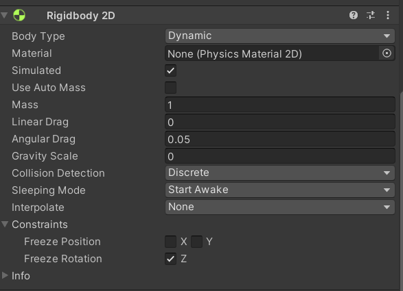
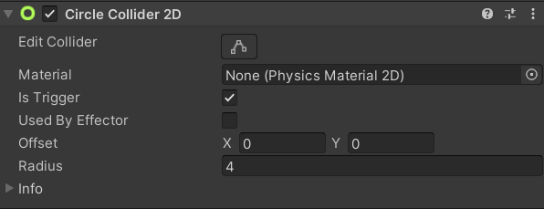
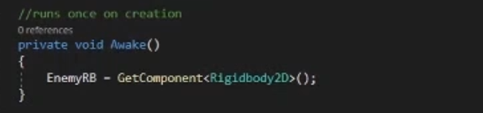
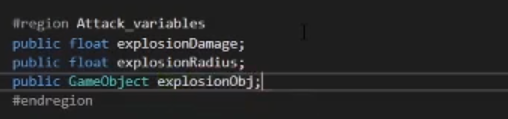

## Section 2 - Creating the Enemies

In the arena of challenges, foes emerge as catalysts for resilience and architects of growth. Embrace the dance with adversaries, for it is through the crucible of opposition that the strength of character is forged.

In this section, we will be creating a enemy for the player to fight. The enemy will have a line of sight of radius r and if the player is within this radius, it will move towards the player and explode upon contact; dealing damage to the player. The player will also be able to deal damage back to the enemy

Summary:

1. Create enemy that tracks and chases the player
2. When the enemy makes contact with the player, it explodes and deals damage to the player
3. Implement the ghost walking animation for the enemy

## Enemy Setup
Like you did with the player, make a new game object and name it `Enemy`, attach a Circle Collider 2D and a Rigidbody 2D.

 Fig 2.1

Inside the RigidBody2D component:

- Set the gravity scale to zero (fig 2.1) 
- Check the box next to rotation to freeze the z rotation (fig 2.1)

Next, set the Enemy game object's tag to Enemy.
Now, we have a basic enemy game object. 

## Setting Up Enemy Line of Sight

An enemy should attack the player if the player is within a certain radius. 

To create a detection system, lets make a new game object that is a **child of the Enemy game object**; name this game object `LineOfSight`. 

Attach a Circle Collider 2D to your newly created *LineOfSight* game object and **check the IsTrigger checkbox**. When the player enters this circle collider, it will notify the enemy to move and attack the player; adjust the radius of the LineOfSight collider to fit your desired range.

 Fig 2.2

### The Enemy Script

Let's make the enemy chase the player. To do so, we will be working with the following variables:  

```
#region Movement_variables
public float moveSpeed
#endregion

#region Physics_components
private Rigidbody2D rb;
#endregion

#region Targeting_variables
public Transform player
#endregion
```

- `moveSpeed` will let us control the movement speed of the enemy. It is public so that we can adjust the enemy's speed in the unity inspector. 

- `EnemyRB`** will hold a reference to the enemy's Rigidbody2D. This way, we can manipulate the rigidbody's velocity property to create movement.

- `player` will hold a reference to the player's transform component. This way, we can have a easy reference to the player's position for the enemy to move towards. This is public or protected (protected means scripts of children game objects have access) because we will need to set this variable inside the player script.

Now in the awake() function, set the rb variable to the RigidBody 2D component attached to the enemy game object by using *GetComponent<>()* (fig 2.4).

 Fig 2.4

Using the three variables above, implement the logic for the enemy's movement system: **if the player triggers the LineOfSight collider, move the enemy towards the player's transform position.** You will need to edit the `Move()` and `Update()` functions in the *Enemy* script, in addition to the `OnTriggerEnter2D()` function in the *LineOfSight* script.

Functions to modify:

*Enemy.cs*  script -> `Move()` and `Update()`

*LineOfSight* script -> `OnTriggerEnter2D()`

**Task: implement move() and finish the logic in update() of the Enemy script. Fill in the logic for OnTriggerEnter2D() in the LineOfSight script**

Solution (translate hex to ASCII): 

```
68 74 74 70 73 3A 2F 2F 79 6F 75 74 75 2E 62 65 2F 49 39 4A 47 39 6B 55 31 37 52 49 3F 73 69 3D 4B 4A 52 68 50 6E 78 72 36 54 45 48 51 71 59 69 26 74 3D 35 39 31
```

## Dealing Damage to the Player 

Now, when the player gets too close to the enemy, the ghost should chase the player. However, if you stop moving, the ghost will slowly push you off the screen. Instead, we want the ghost to explode and deal damage upon contact with the player. Let's implement the logic for it.

```
#region Attack_variables
public float explosionDamage;
public float explosionRadius;
public GameObject explosionObj;
#endregion
```

- `explosionDamage` is how much damage will be dealt to the player when hit with the explosion of the enemy. It is public so we can easily adjust the damage in the Unity Inspector.
- `explosionRadius` lets us control the enemy's explosion size. It is public so we can adjust the radius in the Unity Inspector
- `explosionObj` will hold a game object that contains the explosion animation. 

 Fig 2.5

Inside the same *Enemy* script, there is a Explode() function you need to implement. The function will be invoked when the player and ghost make contact. Upon contact, a explosion animation will spawn in place of the enemy and deal *explosionDamage* to any player within the *explosionRadius*. Then, destroy the enemy game object at the very end.

Functions to modify:

*Enemy.cs* -> `Explode()`

**Task: Implement Explode()**

Hint: Use a 2D circle raycast (https://docs.unity3d.com/ScriptReference/Physics2D.CircleCast.html) to detect if the player is within the `explosionRadius`.
The raycast returns an array of all objects caught in the circle cast. They will be of type `RaycastHit2D` which hold the same basic properties as game objects such as the `transform` and `tag` property.
Also make sure to set your attack variables in the Unity inspector before testing your code! We provide a explosion prefab located in *Assets > Prefabs* that you can drag into *ExplosionObj*.

Solution (translate hex below to ASCII):

```
68 74 74 70 73 3A 2F 2F 79 6F 75 74 75 2E 62 65 2F 49 39 4A 47 39 6B 55 31 37 52 49 3F 73 69 3D 30 37 55 51 48 35 7A 41 52 65 6A 6E 69 6B 30 58 26 74 3D 31 32 30 37
```

You've implemented the `Explode()` function, but nothing actually happens yet. That's because it hasn't been called yet. Call this function to make the enemy explode upon contact with the player. 

**Task: In *Enemy.cs*, Invoke your Explode() function in OnCollisionEnter2D() if the enemy collides with the player.**

Solution (translate hex below to ASCII): 

```
68 74 74 70 73 3A 2F 2F 79 6F 75 74 75 2E 62 65 2F 49 39 4A 47 39 6B 55 31 37 52 49 3F 73 69 3D 63 77 74 5A 78 74 78 76 30 37 4C 68 52 51 39 50 26 74 3D 31 35 31 32
```

## Enemy Animation 

Right now, the ghost is a static sprite. Lets give it some character by animating their walk cycle. (In this case, float cycle). 

Add an `Animator` component to the Enemy. We already provide you with a ready-to-go animation located in `Assets > Animations > Enemy`, so you can just drag and drop that in to the controller of the animator component via the unity inspector. However, if you would like to get some experience working with the animator and blendtrees (which you'll do a lot) follow the video below to make your own animation.

https://youtu.be/I9JG9kU17RI?si=lWHJnjz5SdM0bKCG&t=1613


