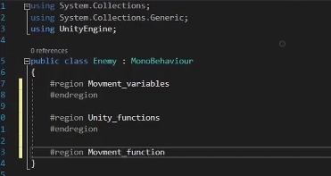

## Section 2 - Creating the enemies

What fun is a game if there are no enemies to fight?

In this section, we will be creating a enemy for the player to fight. The enemy will have a line of sight and if the player is within the enemy's line of sight, it will move towards the player and explode upon contact; dealing damage to the player. In return, the player will also be able to deal damage back to the enemy. 

### Enemy setup
Like you did with the player, make a new game object and name it *Enemy*, attach a Circle Collider 2D and a Rigidbody 2D. 
Modify the Rigidbody 2D by setting gravity to zero and freezing z rotation (fig 1).

[insert fig1]

Next, set the Enemy game object's tag to Enemy.
Now, we have a basic enemy game object. 

An enemy should attack the player if the player is within a certain radius. 

To create a detection system, lets make a new game object that is a **child of the Enemy game object**; name this game object *LineOfSight*. 

Attach a Circle Collider 2D to your newly created *LineOfSight* game object and **check the IsTrigger checkbox**. When the player enters this circle collider, it will notify the enemy to move and attack the player; adjust the radius of the LineOfSight collider to fit your desired range.

[insert img of LineOfSight Inspector]

### Programming the enemy logic

Now, we need to implement the logic to make the enemy move towards and attack the player. 
Make a new script in the scripts folder and name it *Enemy*. Inside the *Enemy* script, set up 3 regions:

1. Movement_variables
2. Unity_functions
3. Movement_functions




### Enemy movement system

Lets move the enemy towards the player. First, we need three variables:

A float variable named *moveSpeed*. This variable will let us control the movement speed of the enemy. Make it pubilc so that we can adjust the enemy's speed in the unity inspector. 

To actually move the player, **create a RigidBody 2D variable** to hold a reference to the enemy's rigidbody.

The enemy will be moving towards the enemy, so it needs to know the location of the player game object. Create a Transform variable named player. Make this public or protected (protected means scripts of children game objects have access).

In awake(), set the rb variable to the RigidBody 2D component attached to the enemy game object.

[img of findComponent fig4]

Using the three variables we just created, implement the logic for the enemy's movement system: **if the player triggers the LineOfSight collider, move the enemy towards the player's transform position.** You will need to edit the Move() and Update() functions in the *Enemy* script, in addition to the OnTriggerEnter2D script in the *LineOfSight* script. 

**Task: implement move() and finish the logic in update() of the Enemy script. Fill in the logic for OnTriggerEnter2D() in the LineOfSight script**

Solution (translate hex to ASCII): 

```
68 74 74 70 73 3A 2F 2F 79 6F 75 74 75 2E 62 65 2F 49 39 4A 47 39 6B 55 31 37 52 49 3F 73 69 3D 4B 4A 52 68 50 6E 78 72 36 54 45 48 51 71 59 69 26 74 3D 35 39 31
```

### Dealing damage to the player 

Now, when the player gets too close to the enemy, the ghost should chase the player. Currently, if you stop moving, the ghost will just push you off the screen. Instead, we want the ghost to explode and deal damage upon contact with the player.

In the *Enemy* script, create a new *Attack_variables* region and add three variables to it: *explosionDamage*, *explosionRadius*, and *explosionObj*. The first two are of type float and *explosionObj* is of type GameObject. All three should be public, so we can adjust and reference as needed in the unity inspector. 

[img of attack variables fig5]

Inside the same *Enemy* script, there is a Explode() function you need to implement. The function will be invoked when the player and ghost make contact. Upon contact, a explosion animation will spawn in place of the enemy and deal *explosionDamage* to any player within the *explosionRadius*. Then, destroy the enemy game object at the very end.

**Task: implement Explode()**

Hint: Use a 2D circle raycast (https://docs.unity3d.com/ScriptReference/Physics2D.CircleCast.html) to detect if the player is within the *explosionRadius*.
The raycast returns an array of all objects caught in the circle cast. They will be of type *RaycastHit2D* which hold the same basic properties as game objects such as the *transform* and *tag* property.
Also make sure to set your attack variables in the unity inspector before testing your code! We provide a explosion prefab located in *Assets > Prefabs* that you can drag into *ExplosionObj*.

Solution (translate hex below to ASCII):

```
68 74 74 70 73 3A 2F 2F 79 6F 75 74 75 2E 62 65 2F 49 39 4A 47 39 6B 55 31 37 52 49 3F 73 69 3D 30 37 55 51 48 35 7A 41 52 65 6A 6E 69 6B 30 58 26 74 3D 31 32 30 37
```

You've implemented the Explode() function, but nothing actually happens yet. That's because it hasn't been called yet. Call this function to make the enemy explode upon contact with the player. 

**Task: In *Enemy.cs*, Invoke your Explode() function in OnCollisionEnter2D() if the enemy collides with the player.**

Solution (translate hex below to ASCII): 

```
68 74 74 70 73 3A 2F 2F 79 6F 75 74 75 2E 62 65 2F 49 39 4A 47 39 6B 55 31 37 52 49 3F 73 69 3D 63 77 74 5A 78 74 78 76 30 37 4C 68 52 51 39 50 26 74 3D 31 35 31 32
```

### Enemy animation (optional)

Enemies look boring as a static sprite. Lets give it some character by animating it's walk cycle. In this case, the ghost enemy doesn't have legs so its going to float around instead. 

We already provide you with a ready-to-go animation located in *Assets > Animations > Enemy, so you can just drag and drop that in. However, if you would like to get some experience working with the animator and blendtrees (which you'll do a lot) follow the video below to make your animation.

https://youtu.be/I9JG9kU17RI?si=lWHJnjz5SdM0bKCG&t=1613


