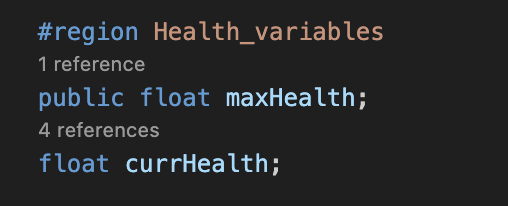
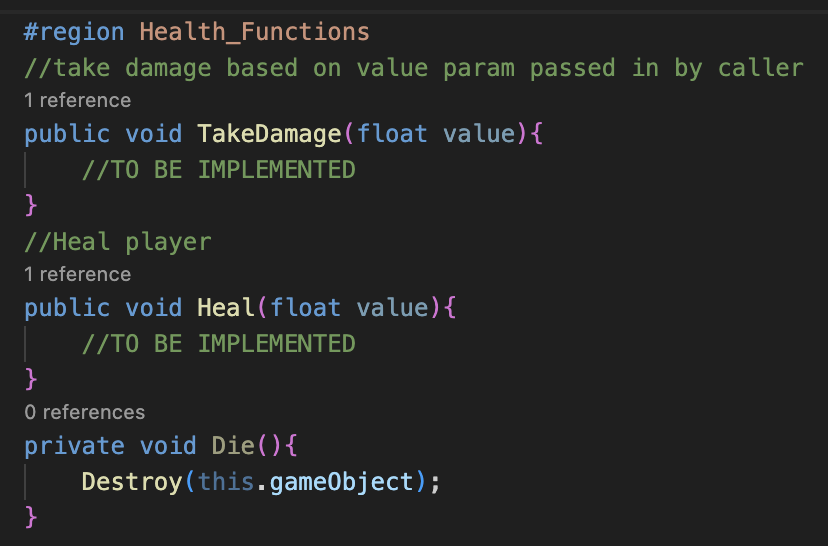
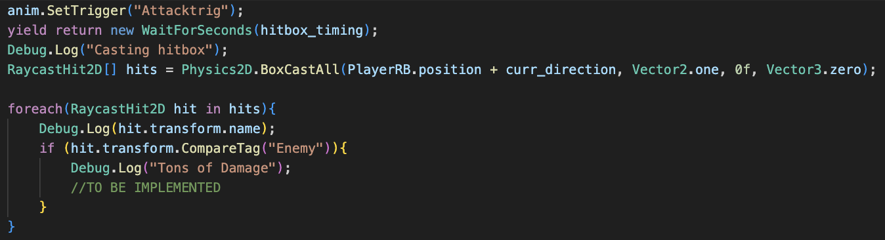

## Section 3 - Health and Damage

**Goals: Implement a health and damage system.**


In this game, the player and the enemy want to take the other down. But without both health and damage systems, neither side can do anything to the other. Our goal for this section is to allow the player and enemy to defeat each other during the game as they exchange successful attacks.


## Health System
Open the `PlayerController` script and create a new region under the existing variables called `Health_variables`. Next, create two float variables within this region; currHealth and maxHealth. Only the maxHealth variable needs to be public, as you will not have to change the currHealth variable directly during the game’s runtime.



In the Awake() function, set currHealth equal to maxHealth. This ensures that the player starts with a full health bar when the game starts.

Now, scroll down to the Health_functions region, where three functions have been set up for you. These functions are responsible for changing the player’s health as the player either takes damage or heals damage. You will be implementing two of these functions.



Task: Fill out the TakeDamage() and Heal() functions in the PlayerController script. Include Debug.Log functions to display the amount of health that the player has after taking damage or healing.

Note: The Die() function is called when the player’s health drops below 0, and the player’s health cannot exceed its maximum health. 

```
Solution (translate hex to ASCII): 68 74 74 70 73 3A 2F 2F 79 6F 75 74 75 2E 62 65 2F 72 59 4A 52 31 41 34 4B 4F 67 6B 3F 6C 69 73 74 3D 50 4C 6B 54 71 66 35 44 42 7A 50 73 41 65 2D 70 52 35 62 44 55 64 77 48 69 43 4E 67 48 63 79 42 49 68 26 74 3D 31 31 30
```
Next, navigate to the Enemy script, where you will implement the same TakeDamage() function from the PlayerController script.

Task: Fill out the TakeDamage() function in the Enemy script. Include a Debug.Log() function to display the amount of health that the enemy has after taking damage.

```
Solution: 68 74 74 70 73 3A 2F 2F 79 6F 75 74 75 2E 62 65 2F 72 59 4A 52 31 41 34 4B 4F 67 6B 3F 6C 69 73 74 3D 50 4C 6B 54 71 66 35 44 42 7A 50 73 41 65 2D 70 52 35 62 44 55 64 77 48 69 43 4E 67 48 63 79 42 49 68 26 74 3D 33 39 34 20
```
Now, both the enemy and the player have a functional health system, but they do not have a way to damage one another. To add a damage system, we will be using 2D raycasts. 
Damage System
Head to the AttackRoutine() function within the PlayerController script. This function is called whenever the player attacks. Within the foreach loop, the player object is checking whether there are any objects with the Enemy tag inside of the attack hitbox, and returning any objects that it finds.



Task: Deal damage to all enemies within the player’s hitbox in the AttackRoutine() using the TakeDamage() function that you defined earlier. The variable hit refers to the GameObject of each enemy within the player’s attack hitbox.

#(this might be too hard idk it may need more hints)
```
Solution: 68 74 74 70 73 3A 2F 2F 79 6F 75 74 75 2E 62 65 2F 72 59 4A 52 31 41 34 4B 4F 67 6B 3F 6C 69 73 74 3D 50 4C 6B 54 71 66 35 44 42 7A 50 73 41 65 2D 70 52 35 62 44 55 64 77 48 69 43 4E 67 48 63 79 42 49 68 26 74 3D 35 36 37
```
Next, navigate to the Enemy script, where you will implement the same damage functionality from the PlayerController script into the Enemy.

Task: Deal damage to the player in the Explode() function within the Enemy script. Make sure that the GameObject is destroyed when the enemy hitbox finds its target.
```
Solution: 68 74 74 70 73 3A 2F 2F 79 6F 75 74 75 2E 62 65 2F 72 59 4A 52 31 41 34 4B 4F 67 6B 3F 6C 69 73 74 3D 50 4C 6B 54 71 66 35 44 42 7A 50 73 41 65 2D 70 52 35 62 44 55 64 77 48 69 43 4E 67 48 63 79 42 49 68 26 74 3D 36 32 33 20
```
Now the enemy and player in our game can deal damage and kill each other. Change the health value of the player in the inspector to make sure that the player dies or does not die, and takes damage as expected.

**Tasks:**
Create player health system
- TakeDamage()
- Heal()
- Die()
- Leave alone for a future section
- Create enemy health system
- TakeDamage()
- Relay damage from entity to entity
- Call TakeDamage()
- Create explosion prefab and destroy enemy

{: .note}
> Double-clicking on a Debug.log message in the console takes you to the line in the script

Relevant Scripts:
`PlayerController.cs`
`Enemy.cs`

Contains:
Health system for player and enemy
Damage system for player and enemy
