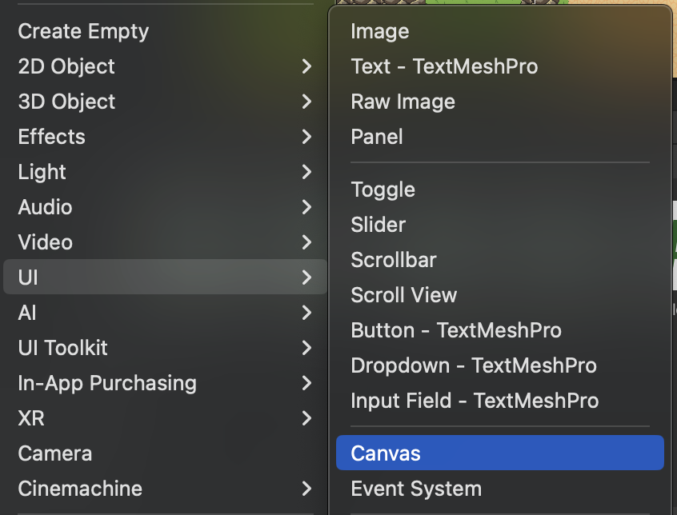
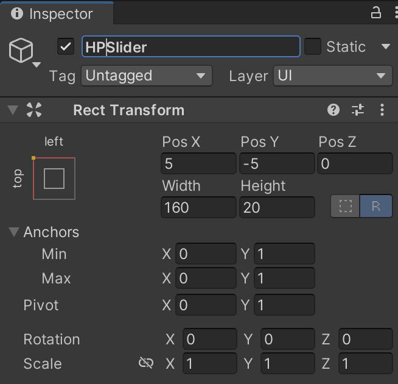
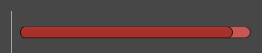

## Section 4 - Health UI

During the last section, we have successfully created a health and damage system for the player and the enemies. But as of right now, the player has no way of knowing how much health they have at any given moment.

In this section, we will be using Unity’s UI (User Interface) components to create a health bar for our game that displays the amount of health that the player has.

## Health Bar

#### Summary:
1. Create a health bar and place it within the scene.
2. Getting the health bar to change dynamically depending on the player's health.

Make sure to set your player’s health to at least 5 so that it does not die to one enemy attack.

Right click on the Hierarchy and select `UI > Canvas.` This will create a `Canvas` object that will store all of your UI elements, along with an `EventSystem` object that manages interactions between the player and the UI. **Do not delete the `EventSystem` object.**



{: .highlight}
With the `Screen Space - Overlay` setting on the `Canvas` object, all UI elements within the `Canvas` will be rendered on the player’s screen above the game world. This will suit our needs of a health bar being visible to the player at all times. If you decide on adding more UI elements in the future, such as a points system or a second resource bar, they will also be displayed on top of the game world as long as they are stored inside of the `Canvas` object.

To make our health bar, we will be using a `Slider` object. Right click on the `Canvas` object and select `UI > Slider`. A slider should appear in the middle of your Scene view as a child to the `“Canvas”` object. 

Rename this slider to *HPSlider* and click on the crosshair under the `RectTransform`component. Hold Shift and Alt while clicking on the anchor preset on the top left. This should anchor your slider to the top left of the screen. To keep it from hugging the top left corner of the screen too tightly, change the `X` and `Y` positions to -5 and 5 respectively. (You are free to adjust these values if you need more space.)



Your slider object’s transform should look something like this.

Slider objects can be placed within a settings menu for the player to change volume and more, but they can also be used for progress bars and resource bars. A key difference is whether the slider can be interacted with by the player or not.

Under the HPSlider object, there are three children objects titled `Background`, `Fill Area`, and `Handle Slide Area`. For our health bar, we do not need our slider to be interactable, so you can delete the `Handle Slide Area` object. Click on the `Fill Area` object and change the Left and Right transforms to 0. Next, click on the `Fill` object under the `Fill Area` and change the `Width` transform to 0. This is to allow the fill area to reach both sides of the slider completely.

We can also change the color of the slider to represent health more clearly. Look for the `Fill` object under the `Fill Area` object, and change the color to whatever color you think represents health the clearest (Red is typically the standard for video games). 



Your slider should look something like this. Move the value slider in the Slider component of the `HPSlider` object between 0 and 1 to make sure that the health bar depletes completely and reaches the maximum.

Now, we have to connect the player’s health to the health bar with the power of scripting. Head to `PlayerController.cs` and add `using UnityEngine.UI;` to the top of the script so that we can access Unity’s UI components from the code. Create a `Slider` variable titled `HPSlider`, which will hold a reference to the health bar in the scene itself.

Next, you will make the health bar move depending on the player's health in `PlayerController.cs`.

1. In `Awake()`, set `HPSlider.value` to a ratio between the player's *current* health and *maximum* health.
     - This is to make sure the scene loads in with the correct amount of health displayed.
2. Update `HPSlider.value` in `TakeDamage()` and `Heal()` under `Health_functions` the same way as in `Awake()`.
     - The order that you update UI variables matters! Make sure that the correct values are being displayed in the scene.

Head back to your Scene view and drag the *HPSlider* object to the `HPSlider` variable in the *Player* object. Test the game to see if the health bar displays the correct ratio of health when the game starts and when you take damage from an enemy.

{: .important}
> Below is the hex code for the solution.

``` 
68 74 74 70 73 3A 2F 2F 79 6F 75 74 75 2E 62 65 2F 50 37 41 5F 30 36 50 62 2D 45 38 3F 6C 69 73 74 3D 50 4C 6B 54 71 66 35 44 42 7A 50 73 41 65 2D 70 52 35 62 44 55 64 77 48 69 43 4E 67 48 63 79 42 49 68 26 74 3D 34 30 37 
```


