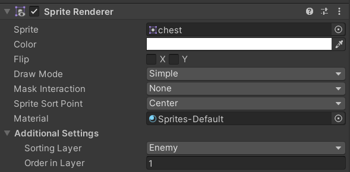
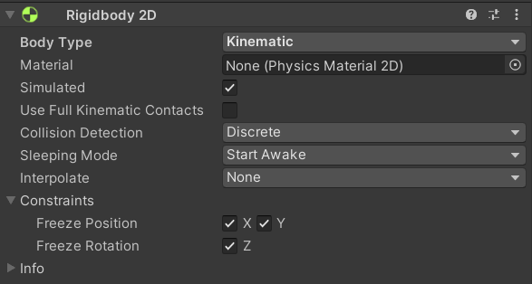
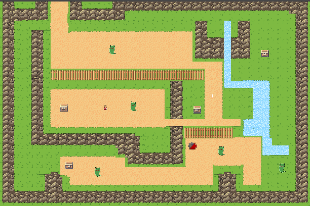

## Section 6 - Pickups

In this section, you will implement a chest object and a health potion object, before programming the ability to open these chests and receive potions.

## Setting Up  Chest and HealthPack
Right click in the hierarchy to create a new sprite GameObject `2D Object > Sprite` and rename it to `Chest`. Then, follow these steps: 

1. In your project's directory, navigate to `Assets > Sprites > Items` and drag the *Chest.png* into the `Sprite Renderer` component's `Sprite` box.

2. Inside the `Sprite Renderer` component, look under "Additional Settings", set the `Sorting Layer` to `Enemy`.

 Fig 6.1

2. Add a `Rigidbody 2D` component and a `Box Collider 2D` component. Change the `Rigidbody 2D`'s body type to `Kinematic`. Kinematic means this game object is unaffected by gravity and can only be moved by scripts.

 Fig 6.2

Now, create another sprite GameObject and name it `HealthPack`. Repeat the following steps above for `HealthPack`.

### Health Pack Script

Navigate to the Scripts folder `Assets > Scripts` and add the *HealthPack.cs* script to your *HealthPack* game object. Double click the script to edit it. 

In *HealthPack.cs*, start by creating a new region `HealthPack_variables` and add a int variable named `healthAmount`.

When a player walks over a health potion, it should boost their health points and disappear; signaling to the player that the potion has been used. 

**Task: In *HealthPack.cs* fill in the `OnTriggerEnter2D()` function so the player gains `healAmount` of health when collided with. Add the potion sound to your script as well.**

Solution (translate hex to ASCII):
```
68 74 74 70 73 3A 2F 2F 79 6F 75 74 75 2E 62 65 2F 50 6C 77 31 4F 30 55 75 5F 7A 51 3F 73 69 3D 66 74 31 61 6D 35 71 64 4F 6C 6E 77 58 37 70 52 26 74 3D 32 37 39
```

Make your `HealthPack` game object into a prefab.

## Chest Script

Navigate to the Scripts folder again and add the *Chest.cs* script to your *Chest* game object. Double click the script to edit it.

Under a new region `Healthpack_variables`, create a variable with type `GameObject` and name it `healthPack`. We will need this variable to spawn health packs when chests are opened. 

When a player interacts with a chest, the chest should disappear, leaving behind a health potion for the player to pick up. 

**Task: Fill out the `DestroyChest()` function so a chest is destroyed and leaves in-place a Health Pack** 

Solution (translate hex to ASCII):
```
68 74 74 70 73 3A 2F 2F 79 6F 75 74 75 2E 62 65 2F 50 6C 77 31 4F 30 55 75 5F 7A 51 3F 73 69 3D 51 6B 57 44 64 42 45 6B 6D 47 41 52 53 64 65 62 26 74 3D 34 35 35
```

Back in the Unity editor, with `Chest` selected, drag and drop a reference to the `HealthPack` prefab into this variable via the Unity inspector. Then, make your `Chest` into a prefab. 

Now, scatter some chests into your map by dragging and dropping the `Chest` prefab into your scene multiple times.

 

Here is a example of what your scene should look like now.

##  Interacting with Pickups

We just implemented the Interact() function for *Chest*, that when called, destroys the *Chest* game object and leaves in its place a *Health Potion*. 
As of right now, the function is not being used. Lets make use of it now.

The `Interact()` function should be called whenever the player presses "E" on a chest.  

//note: change function name Interact() -> Open()


First, open up the *PlayerController.cs* script and add a conditional if statement inside the `Update()` function to repeatedly check if the player presses the "E" key. If the "E" key is pressed, call the *PlayerController*'s `Interact()` function; we  shall implement the functionality of this function in the next step.

```

/* PlayerController.cs */

void Update() {
    if (Input.GetKeyDown(KeyCode.E)) {
        Interact()
    }
}

```

Still inside the *PlayerController.cs* script, navigate down to the Interact() function. This function, when invoked, will check if the player is facing a chest, if so, it will call that particular `Chest` instances `Interact()` function to drop a *Health Potion*.

**Task: Implement `Interact()`: use a `BoxCastAll` to check if the player is facing a `Chest` game object` if so, call that `Chest`'s `Interact()` function.**

Hints:

- BoxCastAll() cast rays contained in the width and height of a box. It returns an array of all the objects that get hit by the raycast. The objects will be of type RayCastHit2D.  

Solution (translate hex to ascii):
```
68 74 74 70 73 3A 2F 2F 79 6F 75 74 75 2E 62 65 2F 4E 74 4F 54 70 67 44 4F 7A 49 30 3F 73 69 3D 52 44 43 64 6F 46 35 74 36 68 6A 77 39 44 30 4A 26 74 3D 37 31
```