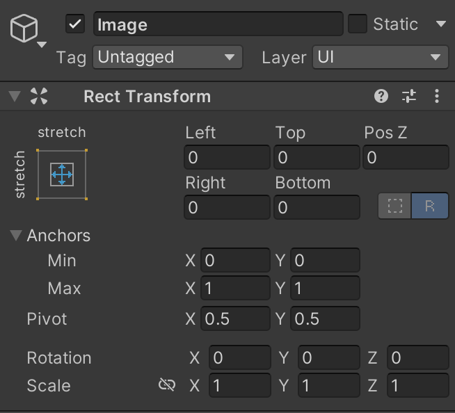
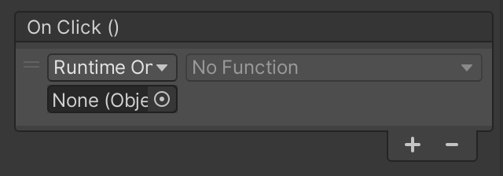

## Section 7 - Menu Screens

Now that the core gameplay has been implemented, we can now round off our game with menu screens that allow the player to navigate from opening the game to playing it and vice versa. Menu screens are a quick way to add polish to your game and improve the user experience, as well as enforcing the style or theme that your game is going for.

## Main Menu
Head to the *Scenes* folder in the Inspector, and right click to create a new scene with `Create > Scene`. Name this scene *MainMenu*, and open the scene. Create a `Canvas` (this will also make an `EventManager`), and name it *MainMenuCanvas*. 

Create a `Text` object under the new canvas and name it *TitleText*. Increase the font size to 40, and change both alignments to the centered option. Change the text to your game’s title. (You can choose this name! If you don’t care, call it *Awesome Game*) 

Create an `Image` under *MainMenuCanvas* and drag it above *TitleText* in the Hierarchy. Notice how the image moves behind the text in the Game view. Click on the `Anchor Preset` box on the top left of the `RectTransform` component and click on the bottom right box with 4 blue arrows extending outwards. Change the `Left`, `Right`, `Top`, and `Bottom` transforms to 0 to stretch the image toward the edges of the screen. 


Fig 8.1

Change the `Color` of the image to your choice of background color. 

Add a `Button` object to the *MainMenuCanvas* and lower the button either in the scene or by changing the `Y` position to -75 in the `Inspector`. Access the *Text* object, the child of *Button*, and change the text to *“Start Game"*.

## Win and Lose Screens

**Task 7.1: Create two more scenes, *WinScene* and *LoseScene*, that will show up when the win and lose conditions are met respectively.**

{: .note}
> Both scenes, at minimum, will have the same components as the *MainMenu* scene, so you can duplicate the scenes to save some time. Make sure to change the components and rename the scene so that they are distinct from the main menu, and that you don't confuse yourself when hopping from scene to scene when you're editing.

{: .important}
> Below is the hex code for the solution.
``` 
68 74 74 70 73 3A 2F 2F 79 6F 75 74 75 2E 62 65 2F 41 33 78 35 69 50 6A 36 6A 6C 63 3F 6C 69 73 74 3D 50 4C 6B 54 71 66 35 44 42 7A 50 73 41 65 2D 70 52 35 62 44 55 64 77 48 69 43 4E 67 48 63 79 42 49 68 26 74 3D 34 39 
```

## Scene Management

To hold all of the scene management code, we will be using a `GameManager` script. The `GameManager` script is typically where, as the name suggests, most of the game management code is stored. Since most of the code that maintains the gameplay has been delegated to other scripts, this `GameManager` script will control scene management.

Open the `GameManager` script and take a look at the code below:

```
public static GameManager Instance = null;

#region Unity_functions
private void Awake()
{
    if (Instance == null)
	{
		Instance = this;
	} else if (Instance != this) {
		Destroy(this.gameObject);
	}
	DontDestroyOnLoad(gameObject);
}
#endregion
```

- The if block checks if a `GameManager` script exists already:
    - If it doesn’t, it assigns itself to a reference that can be accessed in other scripts.
    - If it does, it destroys itself, the GameObject, to prevent itself from overwriting the existing `GameManager`.
- After the if statement, it makes sure that the `GameManager` is not deleted when the game switches between scenes, so that scripts can continue to reference `GameManager`.

Why put so much effort into maintaining a proper `GameManager` script? `GameObjects` are typically not supposed to persist between scenes. However, the `GameManager` script tends to hold important variables that correspond to all parts of the game, from scores to player information and even sound settings. Keeping a single version of the `GameManager` script by using the line `DontDestroyOnLoad(gameObject)` lets the game retain its own information so that it can be used all throughout the game’s different scenes.

Once you’ve looked at the code above, add `using UnityEngine.SceneManagement;` to the top of the script. Importing the `SceneManagement` package allows us to access specific functions to move between scenes in the game.

Scroll down to the `Scene_transitions` region containing four empty functions; `StartGame()`, `LoseGame()`, `WinGame()`, and `MainGame()`. Each of these functions will run whenever a scene change is needed.

1. Using `SceneManager.LoadScene()`, fill in the functions `StartGame()`, `LoseGame()`, `WinGame()`, and `MainGame()`.
	- `SceneManager.LoadScene()` uses one string argument, which is the name of the scene that needs to be loaded. 
	- Each function above should load to a different scene. Scene names are **CASE SENSITIVE**, so double-check your spelling and cases first if you run into issues.


**Task 7.2: Implement `StartGame()`, `LoseGame()`, `WinGame()`, and `MainGame()`.**

Functions to modify:

*GameManager.cs* -> `StartGame()`, `LoseGame()`, `WinGame()`, and `MainGame()`.

{: .important}
> Below is the hex code for the solution.
```
 68 74 74 70 73 3A 2F 2F 79 6F 75 74 75 2E 62 65 2F 78 44 64 31 50 46 44 7A 4E 57 55 3F 6C 69 73 74 3D 50 4C 6B 54 71 66 35 44 42 7A 50 73 41 65 2D 70 52 35 62 44 55 64 77 48 69 43 4E 67 48 63 79 42 49 68 26 74 3D 32 30 37 
```

You have successfully implemented the necessary functions within the `GameManager` script to navigate through the UI! Attach the `GameManager` script to the *GameManager* object and turn the object into a prefab.

We will now hook up the functions to the buttons in each scene. Access the *StartButton* object under `MainMenuCanvas` and scroll to the `Button` component, where you’ll find an `OnClick()` box. Click the plus sign at the bottom right so that the box looks like the figure below. If it already looks like the figure, you do not need to add a second function.	



Drag the *GameManager* prefab into the empty object slot, and select `GameManager > StartGame()` on the dropdown menu. Now when the button is clicked, the `StartGame()` function will execute.

An important step is to head to `File > Build Settings` and click on the `Add Open Scenes` button under `Scenes In Build`. This will add *MainMenu* to the build, which will allow `SceneManager` to access the scene in order to switch to it.

{: .important}
> `SceneManager` functions can only access scenes that are contained in the build. Add scenes that you want to access into the build before testing out the `SceneManager` functions.

Run the scene and click on the "Start Game" button, ensuring that the game transitions into the main game scene, or *SampleScene*. Go ahead and switch to the other scenes as well and make sure that their respective buttons move to the right scenes.

Now, we will implement the rest of the transition functions. Open the `EndTriggerScript` script and look at the method below:

```
private void OnTriggerEnter2D(Collider2D coll)
{
	if (coll.CompareTag(“Player))
	{
		gameObject gm = GameObject.FindWithTag(“GameController”);
		gm.GetComponent<GameManager>().WinGame();
	}
}
```

Since the `EndTriggerScript` script is attached to an invisible `GameObject` with a `BoxCollider2D` component, the method `OnTriggerEnter2D()` concludes the game when the player reaches the goal.
First, it searches the `Hierarchy` for a GameObject with the *GameController* tag. The only `GameObject` that should have this tag is the `GameManager` object.
Afterwards, it accesses `WinGame()` from the `GameManager` script, thereby moving the scene to *WinScene*.

1. Using this method of ending the game, implement a lose condition in the `PlayerController` script.
	- The game should end when the player's health reaches 0.
	- The current scene should move to the scene titled *LoseScene*.

**Task 7.3: Trigger a game over by moving the current scene to LoseScene when the lose condition is met.**

Functions to modify:

*GameManager.cs* -> ???

**Hint: Think of what typically triggers game overs in video games, and look for the function in the script that supports this game over.**

{: .important}
> Below is the hex code for the solution.
``` 
68 74 74 70 73 3A 2F 2F 79 6F 75 74 75 2E 62 65 2F 41 69 68 54 49 45 32 67 2D 6C 55 3F 6C 69 73 74 3D 50 4C 6B 54 71 66 35 44 42 7A 50 73 41 65 2D 70 52 35 62 44 55 64 77 48 69 43 4E 67 48 63 79 42 49 68 26 74 3D 35 38 
```

Give yourself a pat on the back! You have a super mega epic video game of the year triple AAA worthy in your hands!!! Upload your project onto a respository, fill out the Project 1 form on the Decal website, and go take a breather. The facilitator team grants you permission to do so.